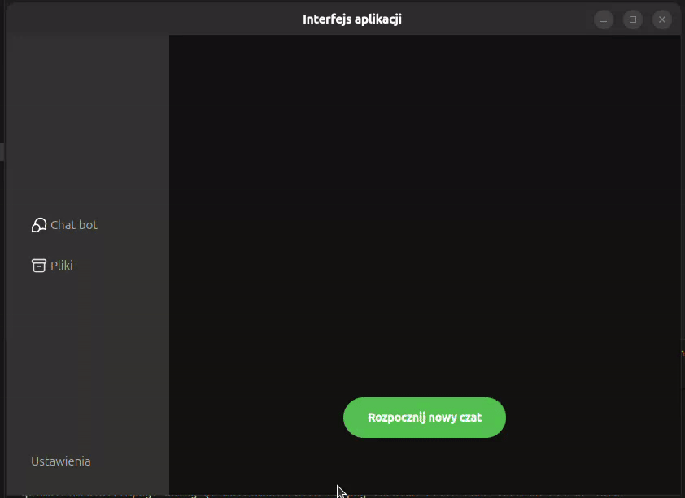
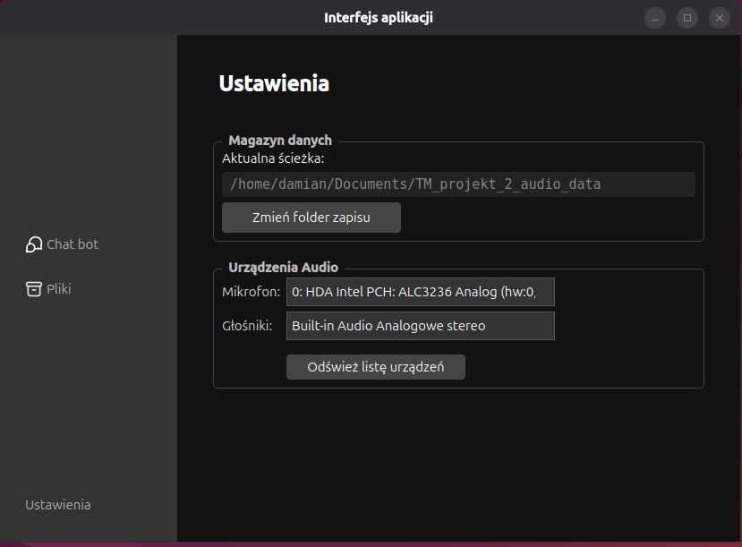

# FAQ VoiceBot (ASR & TTS)

A desktop application integrating speech recognition (ASR) and speech synthesis (TTS) services provided by Techmo. It enables voice conversations with a bot that automatically reads out its responses. The interface was built using **PySide6**.


---

## Detailed Feature Description

### Audio Chat (Voice Bot)
An interface inspired by popular messaging apps, used for recording and sending voice messages.
* **Recording**: Intuitive status signaling (Start / Stop).
* **Verification**: The ability to listen to the recording before sending or to delete it.
* **Attachments**: Option to send pre-recorded files from the disk.
* **Interface**: Messages are displayed as chat bubbles with a built-in audio player.



### Configuration
Full control over the audio environment and application settings.
* Selection of the input device (Microphone) and output device (Speakers).
* Defining the save location for recordings.

<p align="center">
  
</p>

---

##  Setup and First Launch

Before launching for the first time, you need to prepare the environment for both the application and the Rasa bot. The project includes ready-made scripts that automate this process.

### 1. Running the Setup Script

#### Windows
Run the batch file located in the root directory:
```cmd
setup_windows.bat
```

This script will automatically:
1. Create a virtual environment for the application (`.venv`) and install dependencies.
2. Enter the `BotRASA` directory, create a separate environment there (`.venv_rasa`), and install `rasa` and `spacy`.
3. Train the RASA model.

#### Linux
Run the shell script:
```bash
./setup_linux.sh
```
The process is analogous to the Windows version.

### 2. Certificate Configuration
In order for the application to connect to Techmo servers (gRPC), **you must manually place the certificate files** in the appropriate folder.

Create a `cert/tls-client/` folder in the root project directory and place the following files there: `ca.crt`, `client.crt`, `client.key`.

The file structure should look like this:
```text
FAQ_VoiceBot/
├── app/
├── cert/
│   └── tls-client/
│       ├── ca.crt
│       ├── client.crt
│       └── client.key
├── BotRASA/
├── source/
├── main_app.py
└── ...
```

## Running the Application

For the system to work properly, **two terminals** running simultaneously are required.

### Terminal 1: RASA Server
Responsible for the bot's dialogue logic.

**Windows:**
```cmd
cd BotRASA
.venv_rasa\Scripts\activate
rasa run --enable-api --cors "*"
```
**Linux:**
```bash
cd BotRASA
source .venv_rasa/bin/activate
rasa run --enable-api --cors "*"
```

### Terminal 2: Main Application (GUI)
Graphical user interface.

**Windows:**
```cmd
.venv\Scripts\activate
python main_app.py
```
**Linux:**
```bash
source .venv/bin/activate
python main_app.py
```

## Technologies

The application utilizes the following libraries:

* **[PySide6 (Qt)](https://doc.qt.io/qtforpython-6/)** - Modern graphical user interface (UI).
* **[SoundDevice](https://python-sounddevice.readthedocs.io/)** - Low-level audio recording.
* **[SoundFile](https://pysoundfile.readthedocs.io/)** - WAV file handling.
* **[Rasa](https://rasa.com/)** - Open-source framework for building conversational AI.

## Acknowledgments & Project History

This repository is a refactored and refined standalone version of a module originally developed for a university course project at AGH University. The original collaborative project was created together with Igor Kowalski and Damian Pająk and can be found here: **[TM_projekt_2](https://github.com/kacpergoralagh/TM_projekt_2)**.
